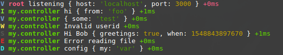

# winston-like-debug

Format logs with [Winston](https://github.com/winstonjs/winston) like you do with [Debug](https://github.com/visionmedia/debug)



```js
const log = require('./logger')('my.controller')

log.info('hi', { from: 'foo' })
log.verbose({ some: 'test' })
log.warn('Invalid userid')
log.silly('Hi %s', 'Bob', { greetings: true }, { when: Date.now() })
log.error('Error reading file')
log.debug('config', { my: 'var' })
```

## Install

```
yarn add winston-like-debug
npm install winston-like-debug
```

## Usage

#### logger.js

```js
const winston = require('winston')
const { likeDebug, withNamespace } = require('winston-like-debug')

const logger = winston.createLogger({
  // This is required to be at top level format
  // See https://github.com/winstonjs/winston/issues/1430
  format: winston.format.splat(),
})

logger.add(
  new winston.transports.Console({
    level: 'silly',
    format: likeDebug(),
  })
)

logger.add(
  new winston.transports.File({
    level: 'debug',
    filename: __dirname + '/output.log',
    format: likeDebug({ colors: false }),
  })
)

module.exports = withNamespace(logger)
```

### Using namespaced logger

#### index.js

```js
const log = require('./logger')('root')

log.verbose('listening', { host: 'localhost' }, { port: 3000 })
```

##### Console output:

<div style="background:#222; padding: 2px 10px">
<span style="color:#0A0"><b>V<span style="font-weight:normal"><span style="color:#FFF"> <b><span style="color:#F55">root<span style="color:#FFF"><span style="font-weight:normal;"> listening { host: <span style="color:#0A0">'localhost'<span style="color:#FFF">, port: <span style="color:#A50">3000<span style="color:#FFF"> } <span style="color:#F55">+0ms<span style="color:#FFF">
</span></span></span></span></span></span></span></span></span></b></span></span></b></span>
</div>

##### output.log file content:

```
2010-01-30T10:04:43.824Z VERBOSE root listening {"host":"localhost","port":3000}
```

### Namespace based on filename

#### auth.controller.js

```js
const log = require('./logger')(module)

log.warn('login', { userId: 98356190 })
```

##### Console output:

<div style="background:#222; padding: 2px 10px">
<span style="color:#A50"><b>W<span style="font-weight:normal"><span style="color:#FFF"> <b><span style="color:#5F5">auth.controller<span style="color:#FFF"><span style="font-weight:normal"> login { userId: <span style="color:#A50">98356190<span style="color:#FFF"> } <span style="color:#5F5">+0ms<span style="color:#FFF">
</span></span></span></span></span></span></span></b></span></span></b></span></span></span></span></span></span></span></span></b></span></span></b></span>
</div>

##### output.log file content:

```
2010-01-30T10:08:03.386Z WARN auth.controller login {"userId":98356190}
```
